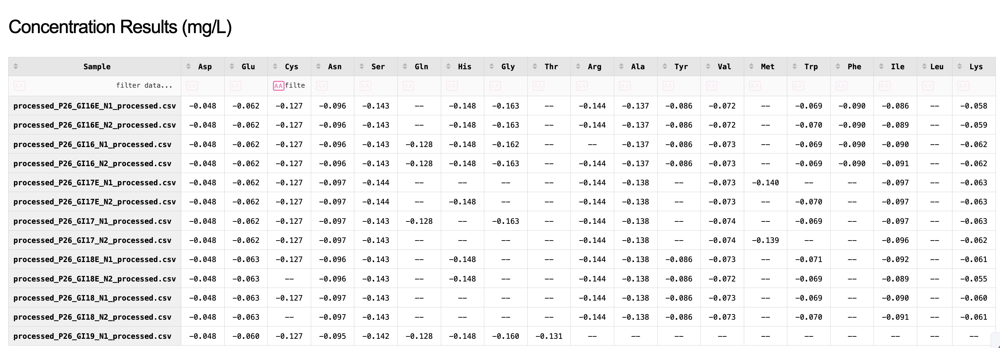
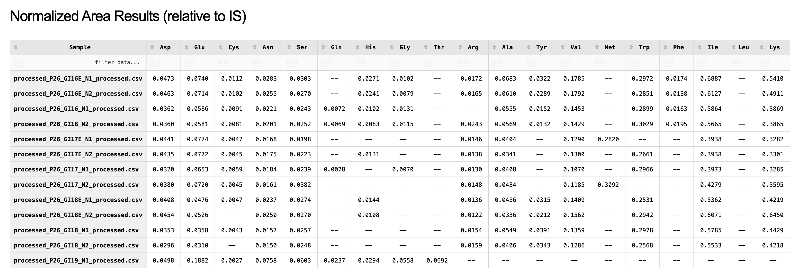
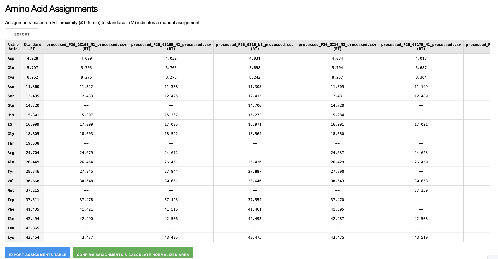
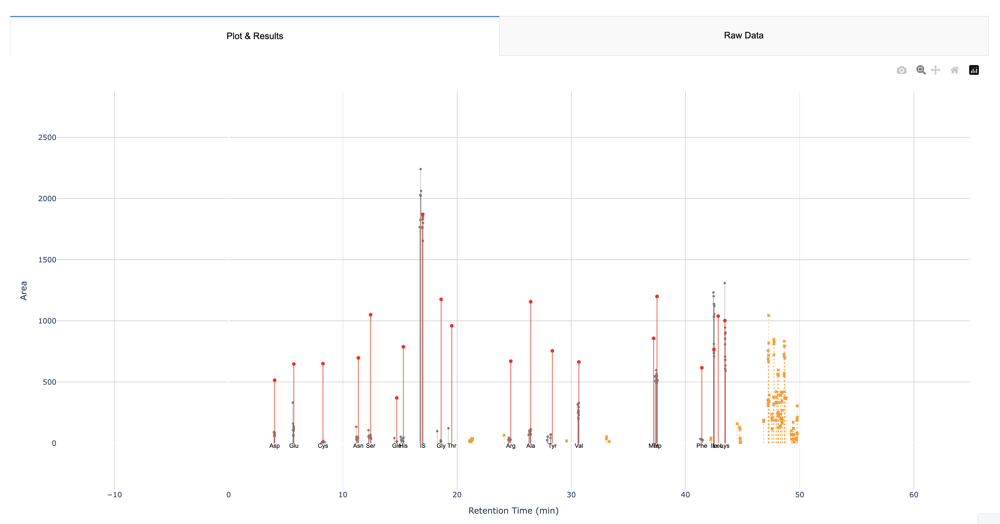

# CSV Plotter with Dash

An interactive web application for visualizing chromatogram data from CSV files. This application uses Dash (by Plotly) for enhanced interactive capabilities including zooming, panning, and drawing tools.

## Features

- Interactive plot with advanced zooming and panning
- Range slider for easy navigation of the data
- File selection interface to choose which CSV files to display
- Color-coded display (standard files in red, others in gray)
- Drawing tools for marking regions of interest
- High-resolution image export

## Requirements

- Python 3.7+
- Dash
- Plotly
- Pandas

## Installation

1. Clone this repository or download the source code
2. Install the required packages:

```bash
pip install -r requirements.txt
```

## Usage

1. Place your CSV files in the `input` directory
2. Run the application:

```bash
python dash_app.py
```

3. Open your web browser and navigate to `http://127.0.0.1:8001/`
4. Use the checkboxes to select which files to display and click "Update Plot"
5. Interact with the plot using:
   - Scroll wheel to zoom in/out
   - Click and drag to pan
   - Double-click to reset the view
   - Use the range slider to navigate the data
   - Use the drawing tools to mark areas of interest

## CSV File Format

The application expects CSV files with at least the following columns:
- "RT [min]" (x-axis: Retention Time)
- "Area" (y-axis: Area)

## License

[MIT License](LICENSE) 

## Example Plots

Below are some example plots generated by the application:


*Figure 1: Final calculated concentration results (mg/L) for each sample, displayed in a table format.*


*Figure 2: Normalized peak area results (relative to the internal standard) for each sample, displayed in a table format.*


*Figure 3: Amino acid assignments table showing the retention time (RT) for each identified amino acid in the sample files compared to the standard RT. Manually assigned points are indicated.*


*Figure 4: Example chromatogram plot showing standard peaks (red), sample peaks (grey), unassigned peaks (orange 'x'), and manually assigned peaks (green circles), along with amino acid labels.* 